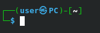

# .bashrc and .zsh Collection

## Bash

### Prompt Generator
Link: [https://bash-prompt-generator.org/](https://bash-prompt-generator.org/)

Generate custom PS1 variables.

### KaMeHb-UA's .bashrc
Link: [https://gist.github.com/KaMeHb-UA/7b12035f29dad630f13a63a3dd72d183](https://gist.github.com/KaMeHb-UA/7b12035f29dad630f13a63a3dd72d183)

Features:
- Helpful Aliases
- Automatic extraction function
- Automatically enables color for various commands

Example:

### Beautiful Bash
Link: [https://github.com/sudonitesh/beautiful-bash]()

Features:
- Helpful Aliases
- Git coloring

Example:

## Zsh

### Kali Linux
Link [https://gist.github.com/Anon-Exploiter/4e12193df0099183d18720c6471d571a](https://gist.github.com/Anon-Exploiter/4e12193df0099183d18720c6471d571a)

Features:
- Automatically enables color for various commands

Example:

